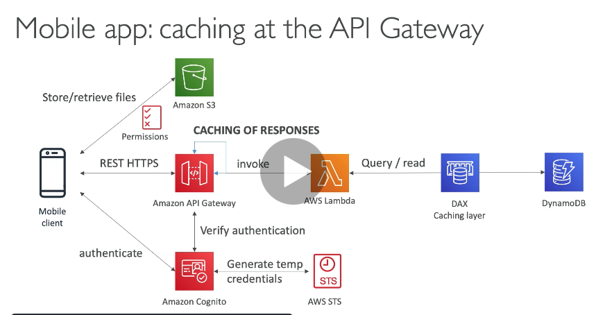
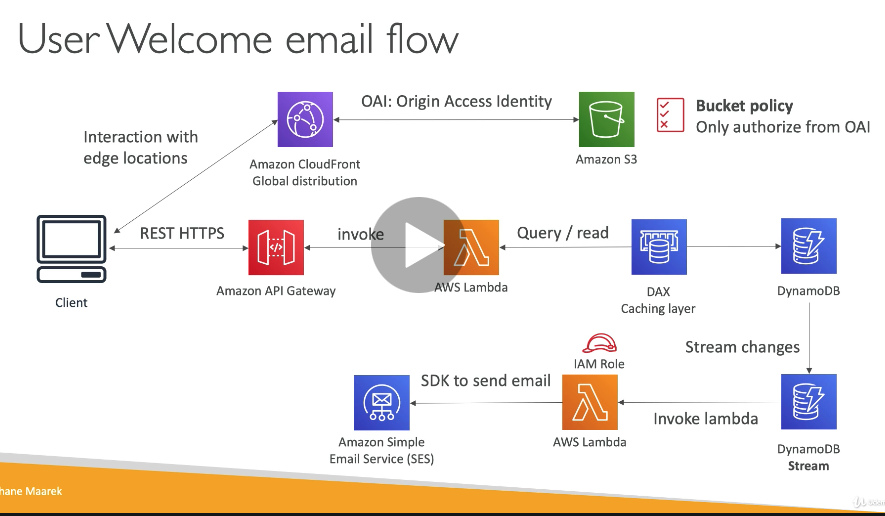
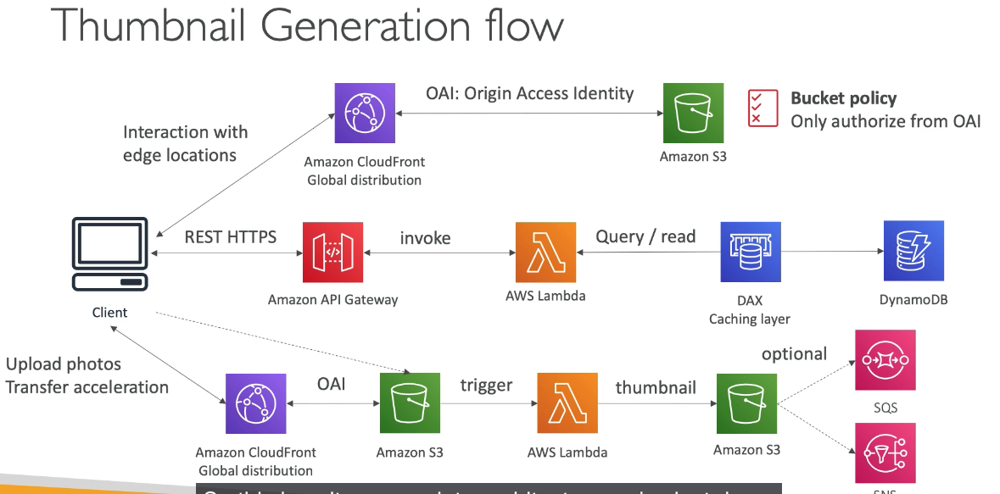
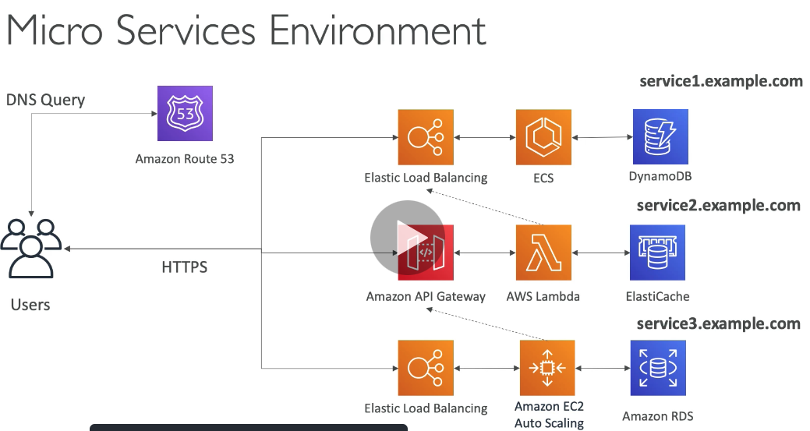
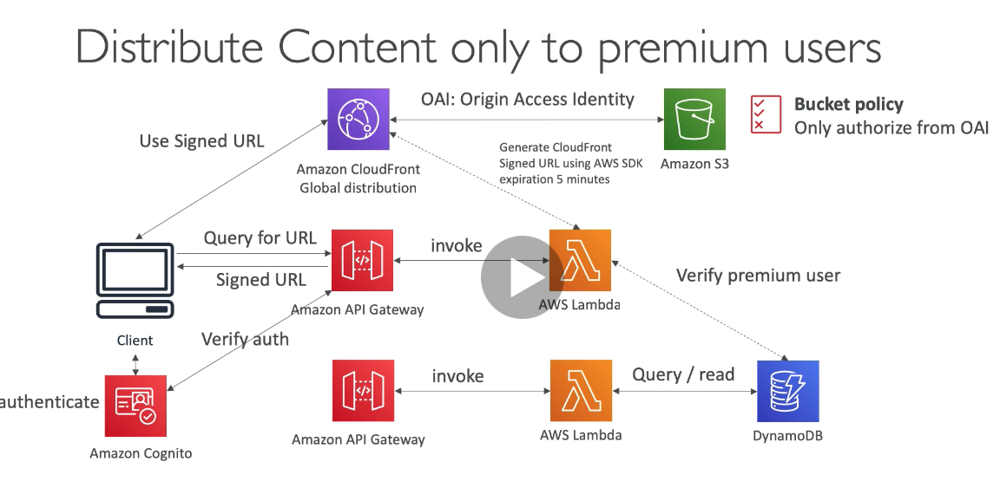

## 186. Mobile Application: MyTodoList

- requirements
- REST API w/HTTPS
- serverless architecture
- users should be able to interact with their own folder in S3
- users should authenticate through a managed serverless service
- users can write and read to-dos, but mostly read
- database should scale, and have some high read throughput
- see slide for arch diagram

- client -> cognito(auth) -> APIGW(REST HTTPS) -> AWS Lambda -> DAX -> DDB
  -> S3 (store files)
  
- summary
  - serverless REST API: HTTPS, APIGW, Lambda, DDB
  - using Cognito to generate temp creds with STS to access S3 bucket w/restricted policy. App users can directly access AWS resources this way. Pattern can be applied to DDB, Lambda
  - caching reads on DDB using DAX
  - caching the REST reqs at the APIGW level
  - security for authentication and authorization with Cognito, STS

#

## 187. Serverless Website: MyBlog.com

- requirements
  - scale globally
  - rarely written, but often read
  - purely static files, rest is dynamic rest API
  - caching must be implemented where possible
  - any new user that subscribes should receive welcome email
  - any photo upload to the blog should have a thumbnail generated
    
    

#

## 188. MicroServices Architecture

- we want to switch to microservice arch
- many services interact with each other directly using a REST API
- each architecture for each microservice may vary in shape and form
- we want a microservice architecture so we can have a leaner development lifecycle for each service
  
- discussion
  - free to design microservices any way you want
  - 2 types of arch patterns: synchronous and asynch
  - challenges of using microservices
    - repeated overhead for creating each new service
    - issues with optimizing server density/utilization
    - complexity of running multiple versions of multiple microservices simultaneously
  - challenges solved by microservices
    - apigw, lambda scale auto and pay per use
    - easily clone API, reproduce environments
    - generated client SDK through swagger integration for the apigw

#

## 189. Distributing paid content

- we sell videos online
- only distribute videos to users who are premium users
- db of premium users
- global
  
- details
  - cognito for auth
  - ddb for storing prem users
  - 2 serverless apps
    - prem user registration
    - cloudfront signed url generator
  - content is stored in S3 serverless and scalable
  - integrated with cloudfront with OAI for security(users cant bypass)
  - cloudfront can only be used using signed urls to prevent unauthorized access
  - what about S3 signed urls? not efficient for global access, and because we're using OAI, wouldnt work

#

## 190. software updates distribution

-

#
