## 237. Section Introduction

- create operate manage a VPC
- 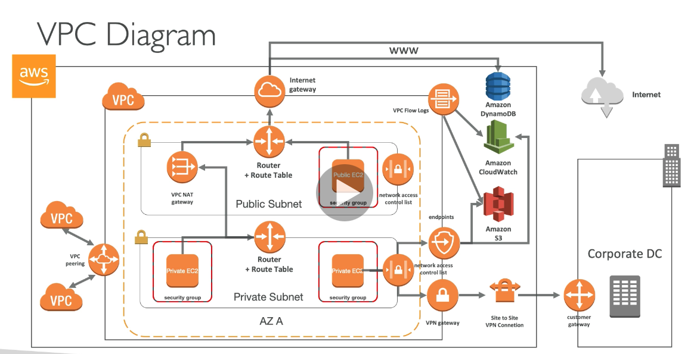

#

## 238. CIDR, Private vs Public IP

- classless interdomain routing
- help define an IP address range
- 2 components
  - base IP
  - subnet mask /xx part
- base IP part represents an IP contained in that range
- subnet mask defines how many bits can change in the IP
- subnet mask can take 2 forms
  - 255.255.255.0 - less common
  - /24 - more common
- 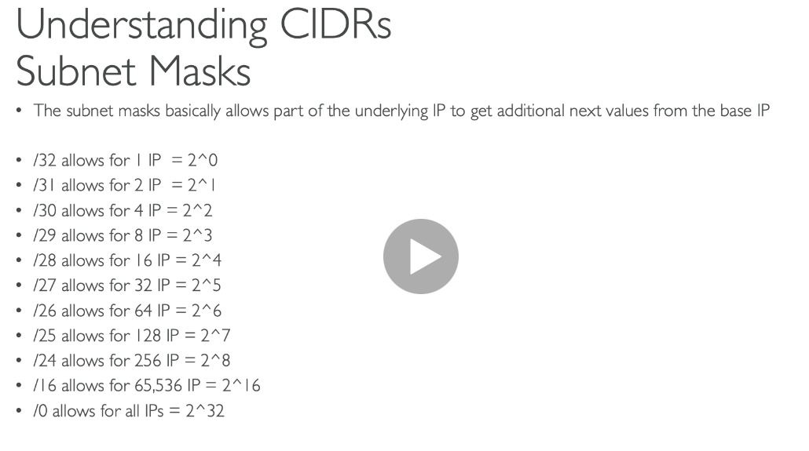
- private vs public IP - v4
- allowed ranges
- certain blocks of IP are blocked for private use
- 10.0.0.0/8(10.0.0.0-10.255.255.255) -> big networks
- 172.16.0.0/12(172.16.0.0-172.31.255.255) -> AWS default
- 192.168.0.0/16(192.168.0.0-192.168.255.255)-> common home networks

#

## 239. Default VPC Overview

- all new accts have a default VPC
- new instances are launched into default VPC is not specified
- default VPC has internet connectivity and all instances have public IP
- we also get a public and private DNS name
- VPC in console
- dashboard resources by region
- comes by default with subnets, route table, NACL, internet gateway

#

## 240. VPC Overview and Hands On

- VPC=virtual private cloud
- can have multiple VPCs in a region (max 5 per region - soft limit)
- max CIDR per VPC is 5. each CIDR
  - min size /28 = 16 ip addresses
  - max size /16 = 65536 ip addresses
  - because VPC is private only private ranges are allowed
- your VPC cidr should not overlap with your other networks
- could use wizard, hands on does it manually
- create VPC
- name tag
- CIDR block
- create
- it created a route table, NACL for us
- can add CIDRs, max of 5

#

## 241. Subnet Overview and Hands On

- tied to AZs
- in each AZ create diff subnets/ 1 private 1 public
- subnets in the dashboard
- create subnets
- AWS reserves 5 IP addresses(first 4 and last 1 IP) in each subnet
- these 5 IPs are not available for use and cannot be assigned to an instance
- ex: if CIDR block is 10.0.0.0/24 reserved IPs are:
  1. 10.0.0.0 Network address
  2. 10.0.0.1 reserved by AWS for VPC router
  3. 10.0.0.2 reserved by AWS for mapping to amazon provided DNS
  4. 10.0.0.3 reserved by AWS for future use
  5. 10.0.0.255 network broadcast address. AWS does not support broadcast in VPC, therefore the address is reserved
- exam tip: remember these addresses cannot be used, so if questions ask about available addresses, keep that in mind

#

## 242. Internet Gateways & Route Tables

- IGs help our VPC instances connect with the internet
- it scales horizontally and is HA and redundant
- must be created separately from VPC
- one VPC can only be attached to one IGW and vice versa
- IGW is also a NAT for the instances that have a public IPv4
- IGWs on their own do not allow internet access
  - route tables must also be edited
- adding IGW
  - IGW from left pane
  - create IGW
- need to change route tables
- edit route table for public subnets
  - add all IPs (0.0.0.0/0) as a destination and IGW as target
- 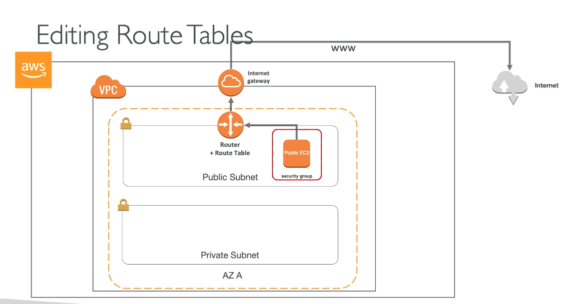

#

## 243. NAT Instances

- allow instances in private subnets to connect to internet
- nat instances must be launched in public subnet
- must disable EC2 setting: source/destination check
- must attach Elastic IP to it
- route table must be configured to route traffic from private subnets to NAT instance
- 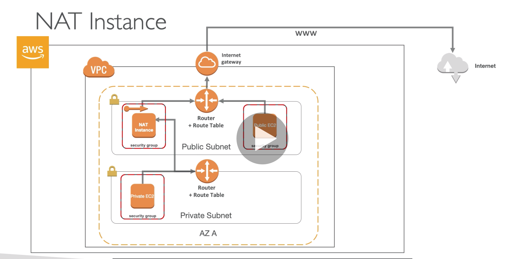
- nat instances are outdated; summary of what we did:
  - use amazon linux ami preconfiguration as a nat instance
  - not HA/resilient out of the box. would need to create ASG in multiAZ
  - internet traffic bandwidth depends on EC2 instance performance
  - must manage security groups and rules

#

## 244. NAT Gateways

- better alt to Nat instances
- AWS manages NAT, higher bandwidth, better availability, no admin
- pay by hour for usage and bandwidth
- NAT is created in a specific AZ uses an elastic IP
- cannot be used by an instance in that subnet, only from other subnets
- requires an IGW private subnet -> NAT -> IGW
- 5gbs of bandwidth with autoscaling up to 45gbps
- no secgroups to manage/require
- 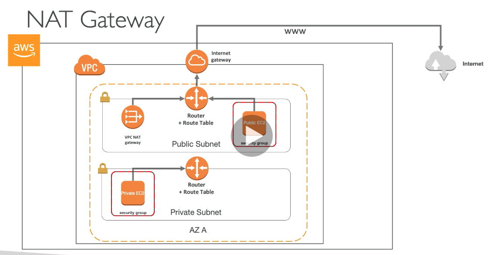
- resilient within a single AZ. for HA must create NATGW in multiple AZs
- 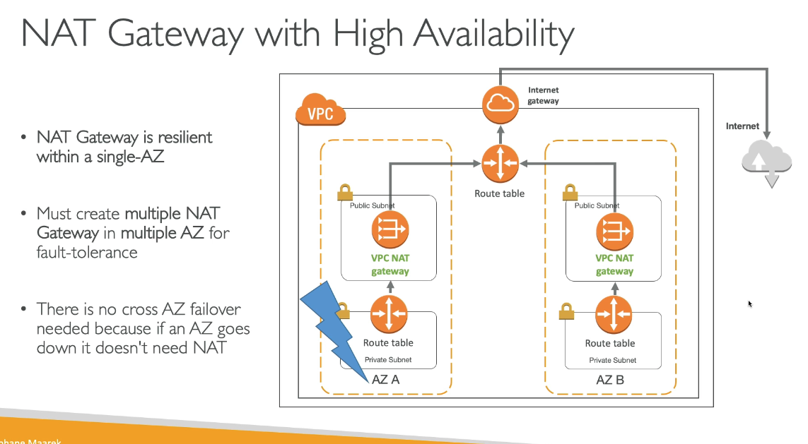

#

## 245. DNS Resolution Options & Route 53 Private Zones

- 2 settings that are important
  - enableDnsSupport - dns resolution setting
  - default is true
  - helps decide if DNS resolution is supported for VPC
  - if true, queries the AWS DNS server at 169.254.169.253
  - enableDnsHostname - DNS Hostname setting
  - false by default for newly created VPC, true by default for default VPC
  - wont do anything unless enableDnsSupport is true
  - if true, assigns public hostname to EC2 instance if it's public
  - if you use custom DNS domain names in a private zone in R53, you must set both of these attributes to true

#

## 246. NACL & Security Groups

- NACLs live outside the subnet, before traffic gets to subnet, the secgroup, and the EC2 instance
- traffic hits nacl first, evaluates if allowed, goes through subnet to secgroup.
- secgroup evaluates if allowed goes to instance
- outbound from secgroup is allowes automatically because secgroups are stateful. if inbound is allowed/outbound is allowed automatically
- outbound traffic hits the nacl, gets evaluated because nacls are stateless. not automatic, needs to be evaluated
- NACL details
  - are like a firewall which control traffic to/from subnet
  - default nacl allows everything outbound and everything inbound
  - one nacl per subnet, new subnets are assigned the default nacl
  - define nacl rules
    - rules have a number for precedence
    - ex: 100 rule would outweigh 200 precedence
    - last rule is an \* and denies a request in case no match
    - AWS recommends adding rules by increments of 100
  - newly created nacls will deny everything
  - used case: nacls are a great way of blocking a specific IP at the subnet level

#

## 247. VPC Peering

- connect 2 VPCs privately using AWS' network
- make them behave as if they were in the same network
- must not have overlapping cidr
- vpc peering connections are not transitive(must be established for each vpc that needs to communicate with each other)
- you can do vpc peering with another aws acct
- good to know
  - vpc peering can work interregion,cross account
  - you can reference a secgroup of a peered vpc(works cross acct)
  - 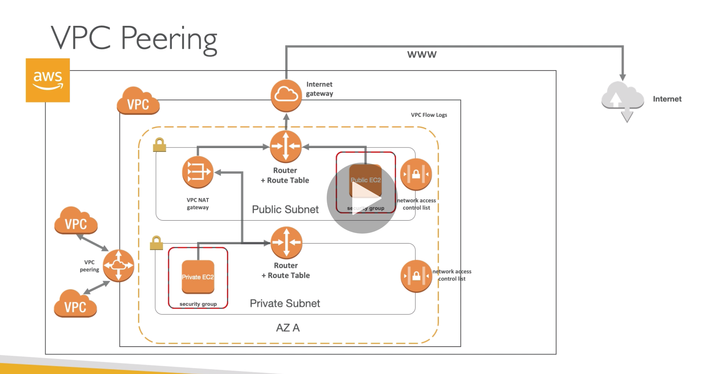
- one vpc is the requester, creates a peer connection request
- connection isnt complete until the requested vpc accepts
- to work also must setup routes in table

#

## 248. VPC Endpoints

- designed for you to access AWS services(see arch diagram)
- endpts allow you to connect to AWS services using a private network instead of a public(www)
  network
- scale horizontally and are redundant
- remove the need to setup IGW,NATGW, etc to access AWS services
- 2 types of endpts
  - interface: provisions an ENI(private IP) as an entry point(must attach secgroup)-most AWS services
  - Gateway: provisions a target and must be used in a route table - S3 and DDB
- troubleshooting
  - check DNS setting resolution in your VPC
  - check route tables if using gateway

#

## 249. VPC Flow Logs & Athena

- capture information about IP traffic going into your interfaces
- 3 types:
  - vpc flow logs
  - subnet flow logs
  - elastic network interface flow logs
- help monitor and troubleshoot connection issues
- flog log data can go into S3 and cloudwatch logs
- can capture network information from some AWS services: elb, rds, elasticache, redshift, workspaces, etc
- 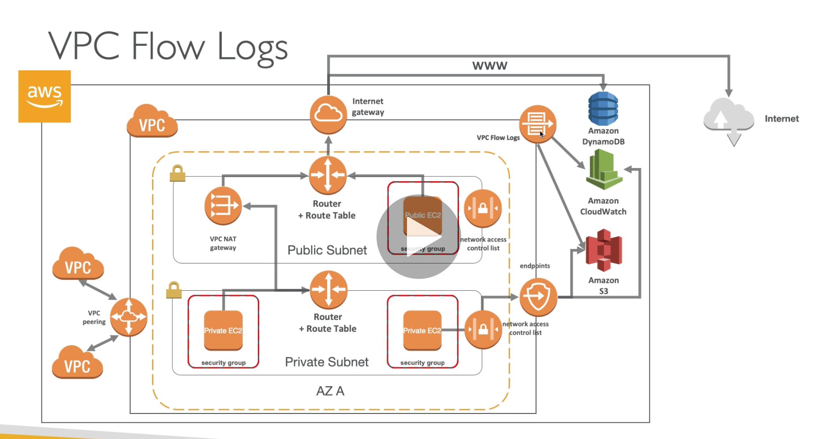
- query vpc flow logs using athena on S3 or cloudwatch logs insights
-

#

## 250. Bastion Hosts

- bastion host is an instance that is in the public subnet which is then connected to all other private subnets
- bastion security group must be tightened
- we can use bastion hosts to SSH into our private instances

#

## 251. Site to Site VPN, Virtual Private Gateway & Customer Gateway

- connect corporate data center to our vpn using CG, VPG
- 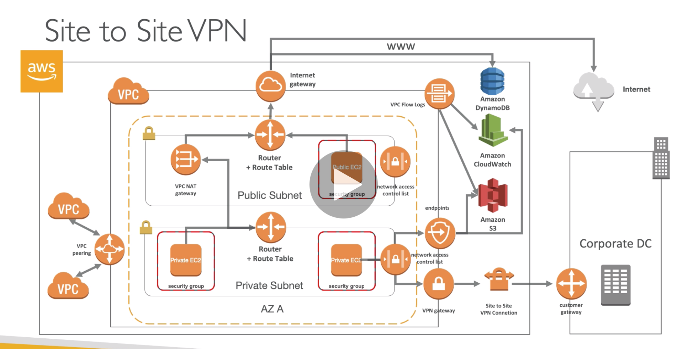
- virtual private gateway
  - vpn connector on the AWS side of the VPN connection
  - virtual GW is created and attached to the VPC from which you want to create the site-to-site VPN connection
  - possible to customize the ASN
- customer gateway
  - software application or hardware on customer side of the VPN connection
  -

#

## 252. Direct Connect & Direct Connect Gateway

- provides a private dedicated connection between VPC and your onprem network
- dedicated connection must be setup between your onprem datacenter(DC) and AWS direct connect locations
- still setup VPGW on AWS side
- access public resources (S3) and private resources(EC2) on same connection
- use cases:
  - increase bandwidth
  - more consistent network connection
  - hybrid environment
  - supports IPv4 and IPv6
- 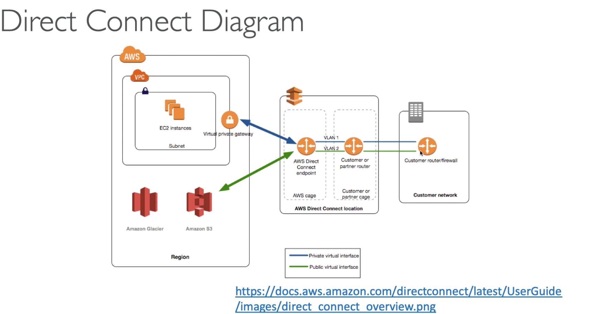
- for connecting more than 1 vpc, use direct connect gateway:
- 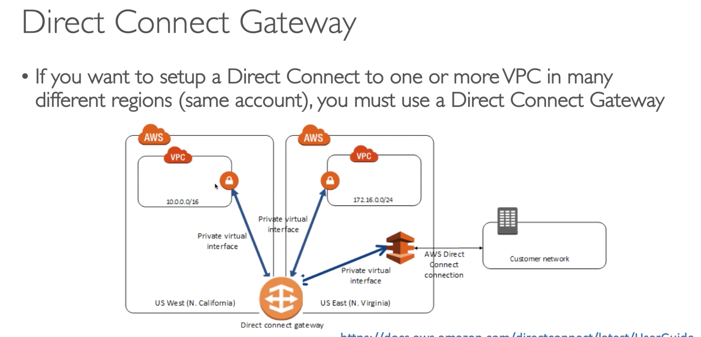
- direct connect connection types
  - dedicated connections 1gbps or 10gbs
  - hosted connection: diff speeds
  - capacity can be added/removed on demand
- lead times are longer than 1 month to establish a new connection
- data in transit is not encrypted but is private
- can combine w/vpn and ipsec

#

## 253. Egress Only Internet Gateway

- outbound only IGW for ipv6 only
- similar function to NAT but for ipv6
- all ipv6 are public, therefore all of our instances with ipv6 are publicly accessible
- with egress only GW, gives our ipv6 instances access to internet, but they arent directly reachable by the internet
- after creating, edit the route table

#

## 254. AWS PrivateLink - VPC Endpoint Services

- secure and scalable way of exposing a service to 1000s of VPCs(own or other accounts)
- does not require VPC peering, IGW, NAT, route tables, etc...
- uses NLB on one side, ENI on the other, creates a private link between the 2
- 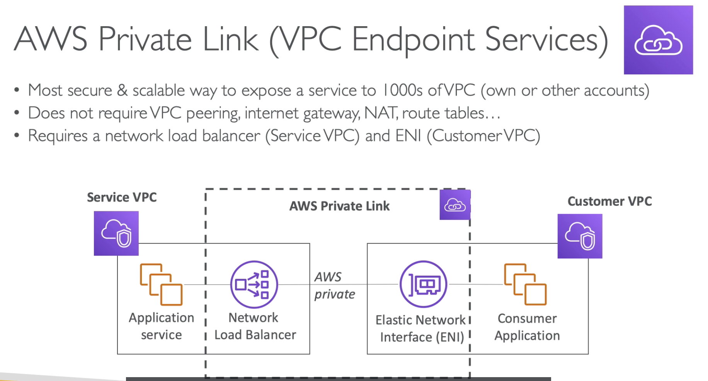

#

## 255. AWS ClassicLink

- deprecated
- EC2 classic is when you run your network in a single instance with customers
- replaced by VPC
- use classiclink for older legacy to connect
- likely to be distractors in the exam

#

## 256. VPN CloudHub

- provides secure connection between sites if you have multiple vpn connections
- 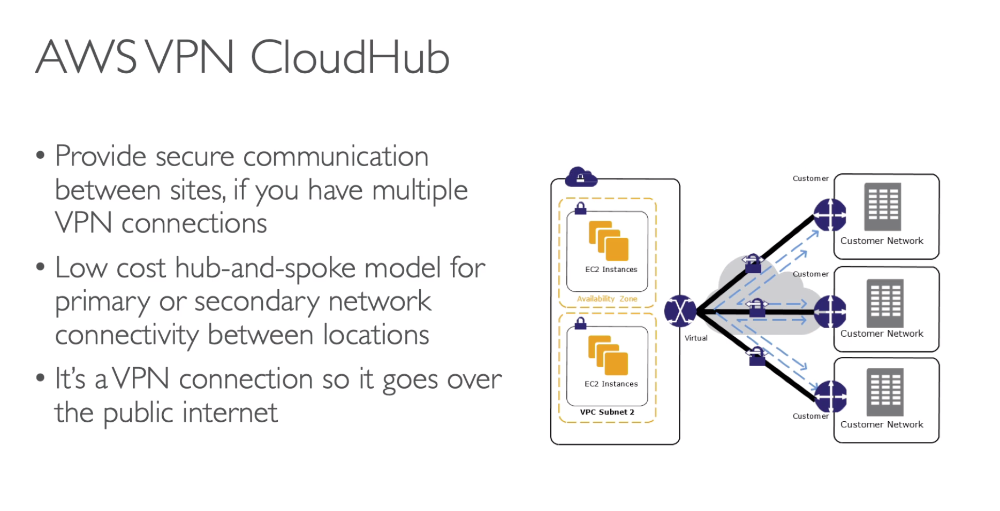

#

## 257. Transit Gateway

- creates a hub and spoke(star) connection between VPC and all onprem centers
- regional source, can be cross region
- share cross acct using Resource Access Mgr
- can peer transit gw across regions
- route tables limit which vpc can talk to who
- works with direct connect gw, vpn connections
- supports ip multicast
- 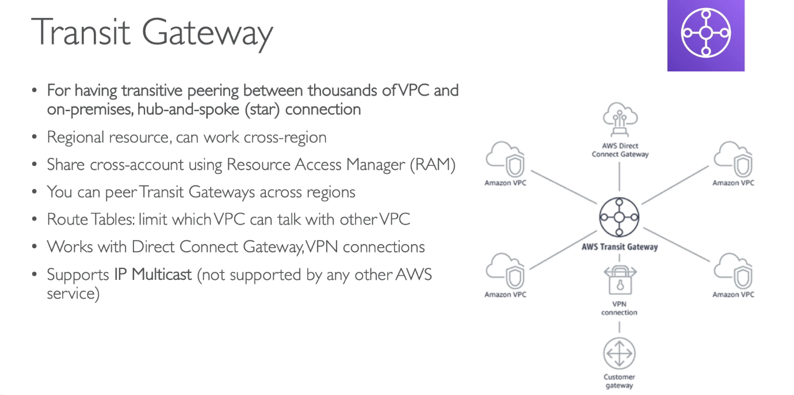

#

## 258. VPC Section Summary

- 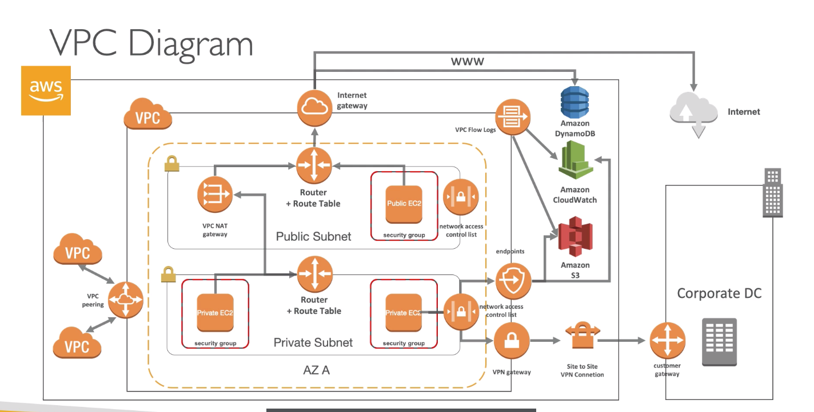
- 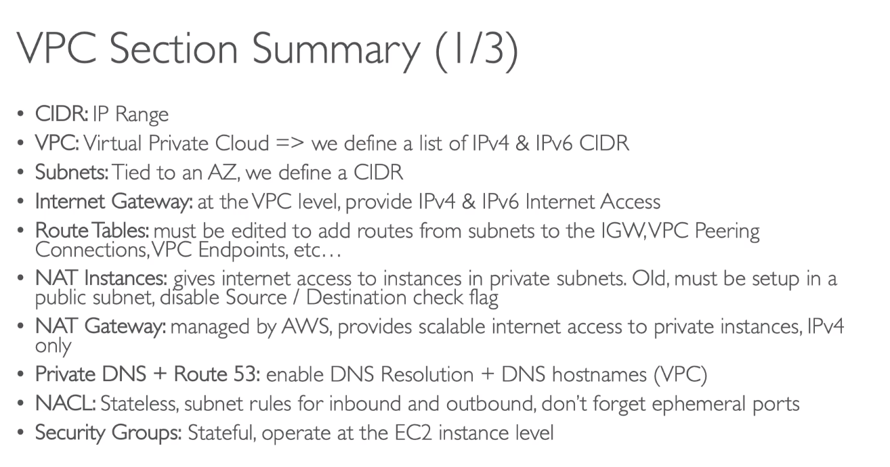
- 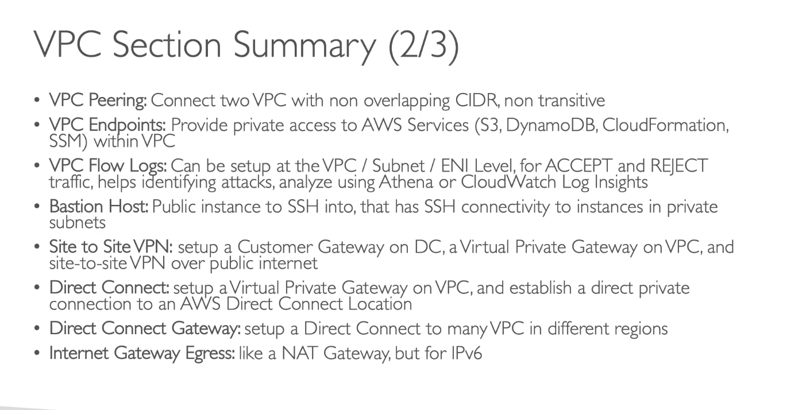
- 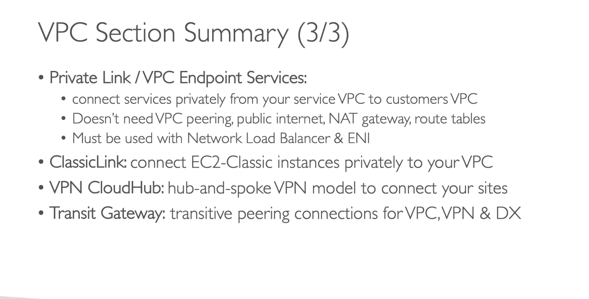

#

## 259. Section Cleanup

- undo everything done from the Hands On during this section

#

## Quiz 20: VPC Quiz

-

#

## 260. Network Costs in AWS

- cheaper to use private ips when communicating between instances
- 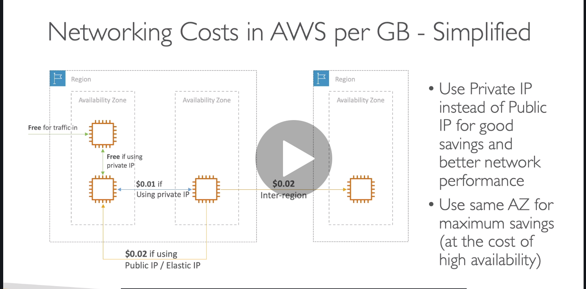

#
