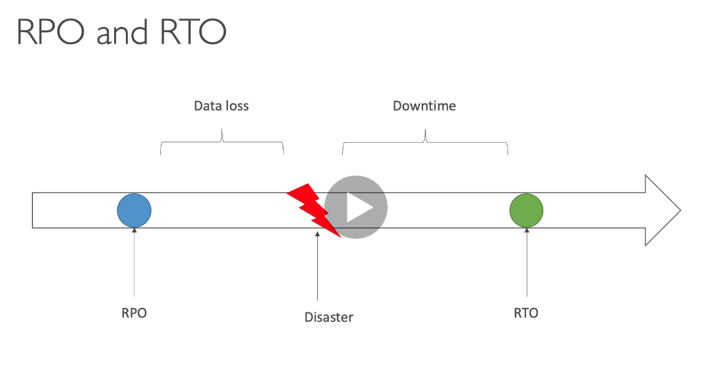
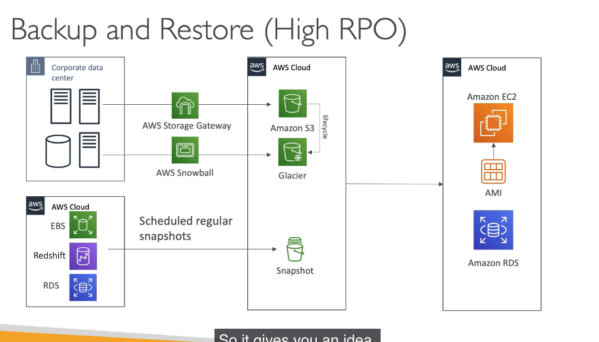
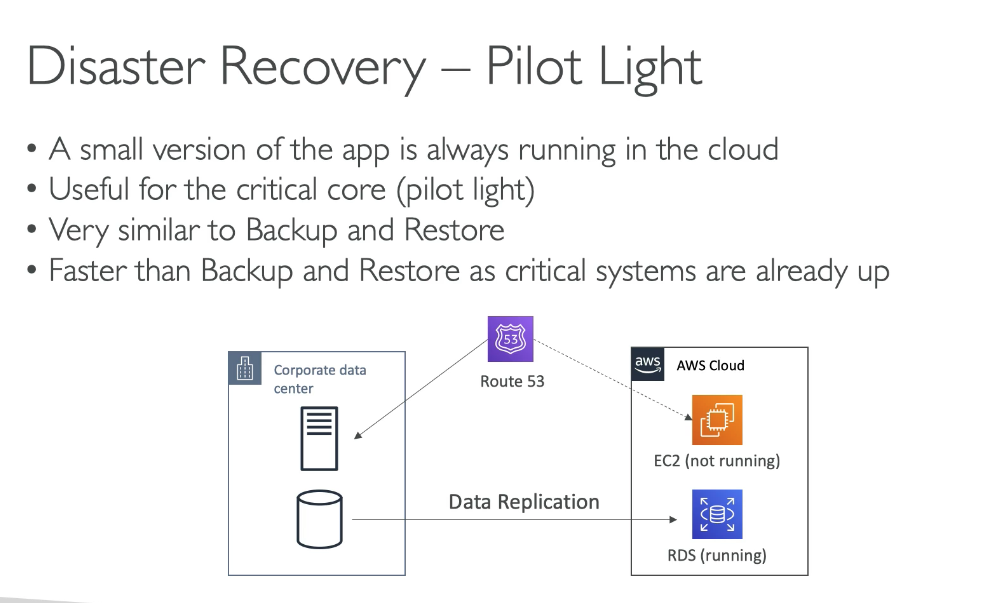
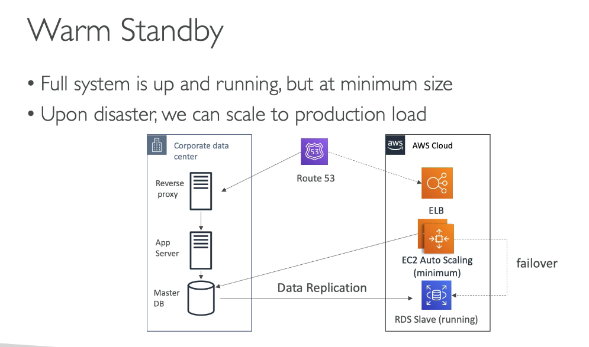
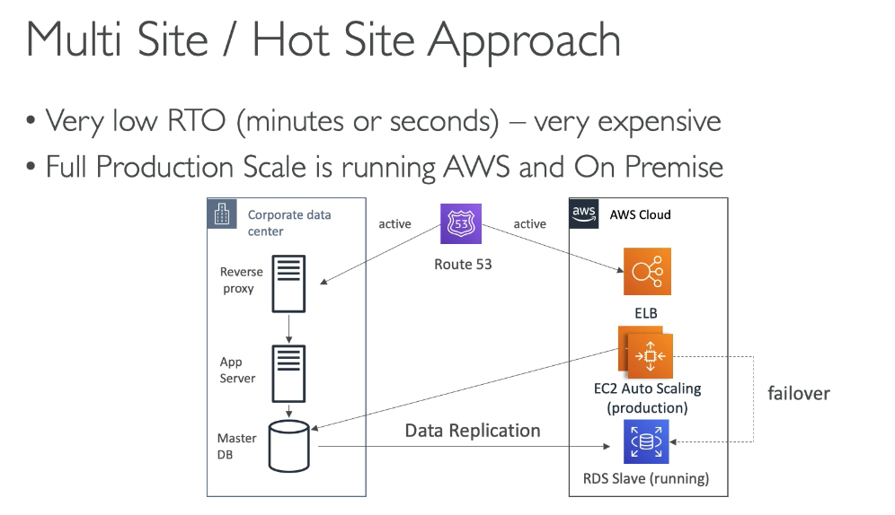
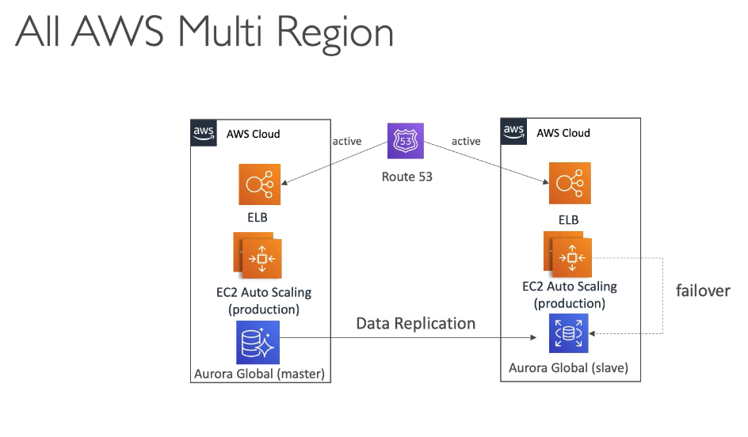
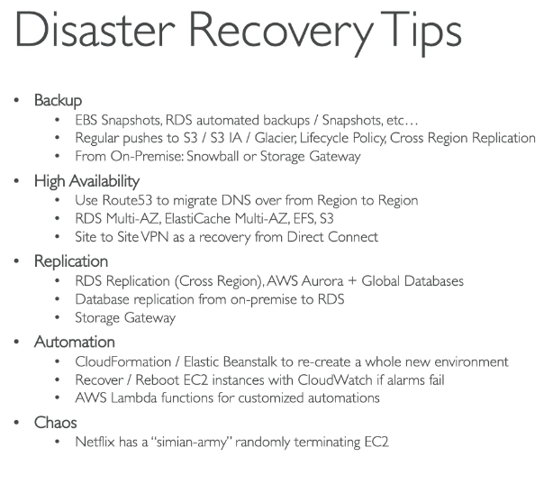
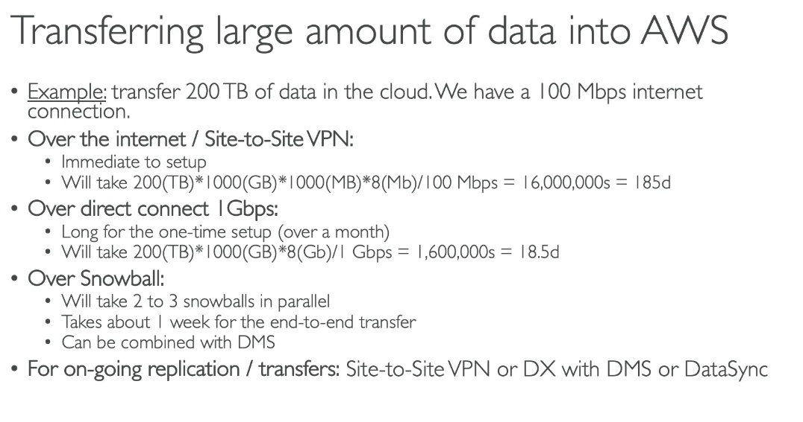

## 261. Disaster Recovery in AWS

- read attached whitepaper for more info. lecture is a summary of whitepaper
- DR is about preparing for and recovering from disaster
- kinds of DR: on-prem, cloud
- 2 terms to know:
  - RPO: recover point objective
  - RTO: recovery time objective
- RPO:
  - how often you run backups. time between your last rpo and disaster is your data loss
- RTO:
  - how long it takes you to recover from disaster. how long is your downtime?
- 
- DR strategies:
  - backup and restore
  - pilot light
  - warm standby
  - hotsite/multi site approach
- back and restore - high RPO
  - cheap to do
    
- pilot light
  - small version of app is always running in cloud
  - faster then backup and restore as critical systems are already up
    
- warm standby
  - full system up and running at min size
  - upon disaster; we can scale to production load
  - more costly
    
- multisite/hot site approach
  - low RTP - very expensive
  - full production scale running on AWS and on prem
    
- All AWS multi-region
  - everything handled on AWS cloud
    
- tips
  - backup
  - HA
  - Replication
  - Automation
  - 

#

## 262. Database Migration Service(DMS)

- quick secure migrate dbs to AWS. resilient, self healing
- source db remains available during migration
- supports
  - homogeneous migrations: oracle to oracle for ex
  - heterogenous: Microsoft SQL to Aurora for ex
- continuous data replication using CDC
- you must create an EC2 instance to perform replication tasks for you
- what if they dont have same engine?
  - you can use SCT - schema conversion tool
  - you dont need to use SCT if migrating the same db engine

#

## 263. Database Migration Service(DMS) - Hands On

- AWS Database Migration Service in console
- name
- instance class
- engine version
- allocated storage
- vpc
- can be multiAZ
- network configuration
- maintenance window
- click create
- create task
- choose instance created above
- create source and target endpoints
- create endpoints
- create task

#

## 264. On-Premises Strategies with AWS

- ability to download AWS ami as an .iso file to run on vmware,virtualbox, etc
- AWS application discovery service
  - gather info about your onprem servers to plan a migration
  - server utilization and dependency mappings
  - track with AWS migration hub
- AWS database migration service
  - replicate onprem -> AWS, AWS->AWS, AWS->onprem
- VM import/export
  - migrate existing apps into EC2
  - create a DR repo strategy for yor onprem
  - can export back the VM from EC2 to onprem
- AWS Server Migration Service - SMS
  - incremental replication of onprem live servers to AWS

#

## 265. DataSync - Overview

- service to move large amts of data from onprem to AWS
- sync to Amazon S3, EFS, FSx for Windows
- move data from your NAS or file system via NFS or SMB
- replication can happen hourly,daily,weekly
- need to install Datasync agent onprem to connect your systems

#

## 266. Transferring Large Datasets into AWS

- summary of how to xfer large amts of data
- example of how long it will take to xfer an example amt of data
- 

#

## Quiz 21: Disaster Recovery Quiz

-

#
