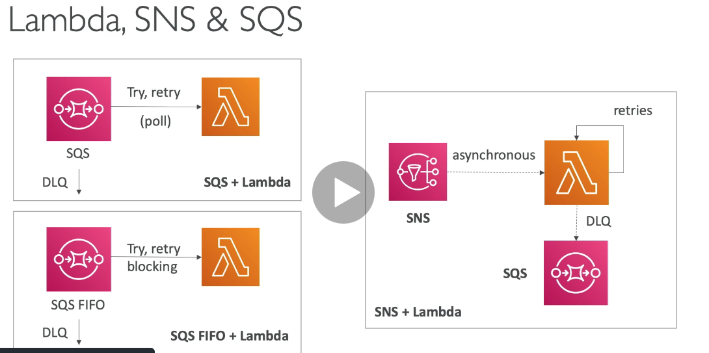
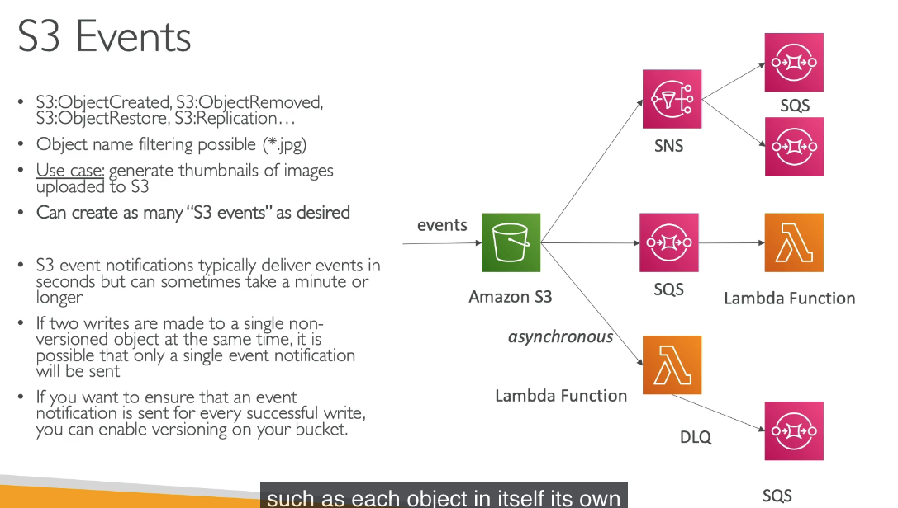
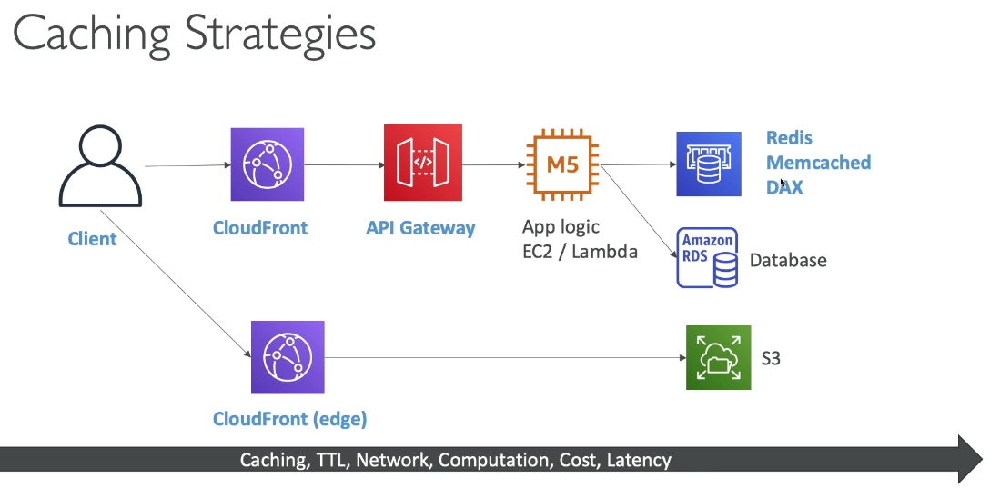
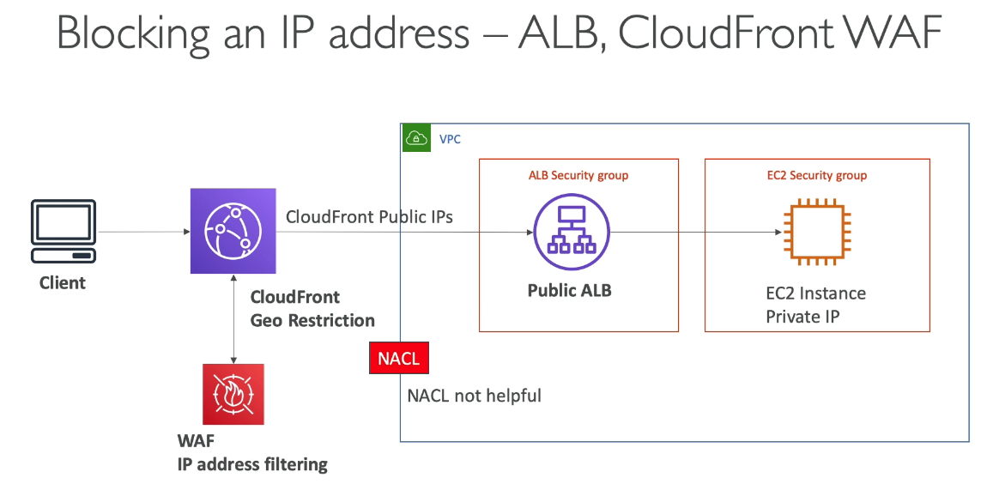
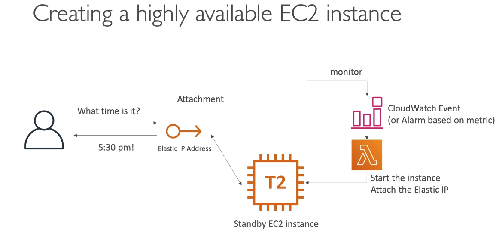
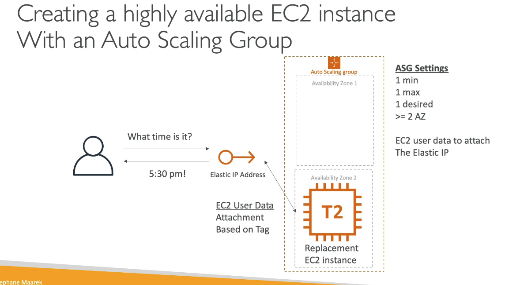
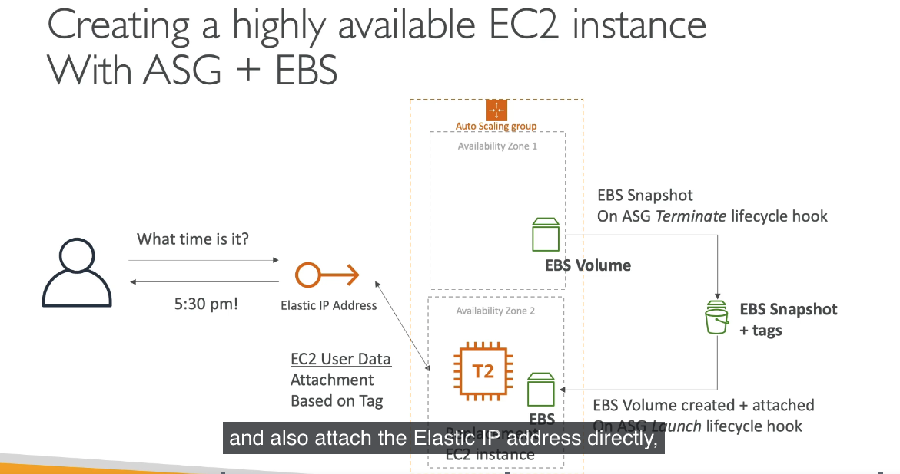
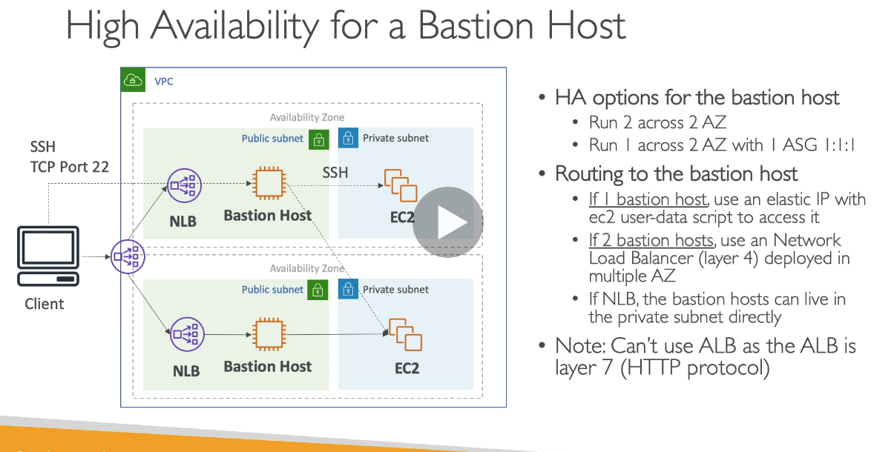

## 267. Event Processing in AWS

- how to setup lambda with SQS vs SNS
- 
- fan out pattern
- 
- combine w/S3 events
- 

#

## 268. Caching Strategies in AWS

- each service in the diagram can cache content but come with tradeoffs
- 

#

## 269. Blocking an IP Address in AWS

- create a deny rule at the nacl.
- nacl is first line of defense. it can deny a specific IP
- could run firewall software to deny the ip
- using an ALB with a sec group that only connects to the sec group of the EC2 instance. the EC2 instance only talks to the ELB
- ALB and EC2 sec groups only allow, cant deny a specific ip. you could allow the IPs you want to give access to if you know them
- could deny a WAF on the ALB to establish IP address filtering
- if using cloudfront, a nacl wont help because the cloudfront's public IP is what is being sent to the vpc. you would have to use cloudfront georestriction if you knew the location of the blocked ip or you could setup a waf at the cloudfront level. see architecture slide
- 

#

## 270. High Performance Computing(HPC) on AWS

- cloud is perfect for HPC
- can create a very high number of resources in no time
- can speed up time to results by adding more resources
- you can pay only for the systems you have used
- computational chemistry, financial risk modeling, weather prediction, machine learning, etc
- data mgmt and xfer:
  - use AWS direct connect
  - or snowball
  - can use datasync
- compute and networking
  - EC2 instance types you need for cpu optimized/gpu optimized
  - can use EC2 placement groups or clusters for good performance
  - EC2 enhanced networking: higher bandwidth, lower latency
  - option 1: elastic network adapter(ENA) up to 100gbps
  - option 2: intel 82599VF up to 10gbs. legacy
  - can use Elastic Fabric Adapter (EFA)
  - distributed computation
  - uses MPI standard
  - bypasses underlying linux OS to provide lower latency
  - linux only
- storage
  - instance attached storage
    - EBS
    - instance store
  - network storage
    - S3
    - EFS
    - FSx for Lustre
- automation and orchestration
  - AWS batch: schedule jobs and launch instances
  - AWS Parallel cluster: open source cluster mgmt to deploy HPC on AWS

#

## 271. EC2 Instance High Availability

- one way: 1 instance with elastic ip using cw monitor with lambda function to xfer the elastic ip if it goes down
- 
- using an ASG
- 
- using ASG and EBS volume
- 

#

## 272. Bastion Host High Availability

- diff ways to do it
- we want to SSH into our private instances
- we SSh into bastion host which is in public subnet then ssh into private subnets
- diff options, you can use an NLB if you have 2 bastion hosts
- cant use ALB because bastion host uses SSH that lives in layer 4 must use NLB
- 

#

## Quiz 22: More Solution Architectures - Quiz

-

#
