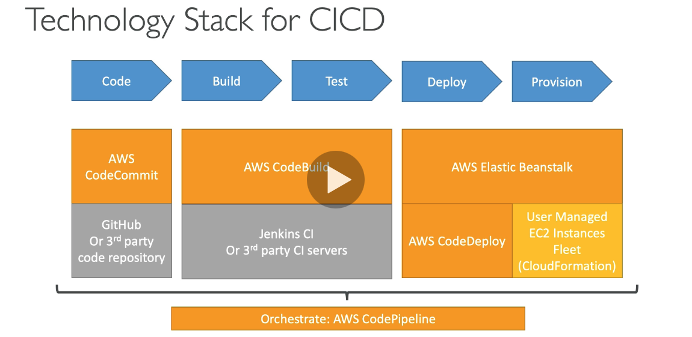

## 273. Other Services Section Introduction

- not a deepdive, overview of a few services
- might be a question or 2 on the exam

#

## 274. CI/CD Introduction

- C/I
  - devs push code to a repo(github,codecommit,etc)
  - testing/build server checks the code as soon as it pushed(codebuild, jenkins,etc)
  - dev gets feedback about the tests and checks if pass/fail
  - find bugs early, fix bugs
  - deliver faster
  - deploy often
- C/D
  - ensure that software can be released reliably when needed
  - ensures deployments happen often and are quick
  - tools like codedeploy, jenkins, spinnaker
- tech stack for ci/cd
  - code, build, test, deploy, provision
  - codecommit -> codebuild-> beanstalk or (codedeploy/cloudformation)
  - orchestrate aws pipeline
  - 

#

## 275. CloudFormation Intro

- infrastructure as code
  - code would deploy/crud our infrastructure
  - declarative way of outlining your AWS infrastructure
  - CF creates your config for you in the right order
- ability to destroy/recreate infrastructure on the fly
- templates have to be uploaded in S3 then referenced in CF
- to update a template, we cant edit previous ones. we have to reupload a new version of the template to AWS
- stacks are id'd by name
  deploy: edit template using YAML file
- components: resources, parameters, mappings, outputs, conditionals, metadata
- references and functions

#

## 276. CloudFormation Hands On

-

#

## 277. CloudFormation - Extras

-

#

## 278. ECS Introduction

-

#

## 279. ECS - Extras

-

#

## 280. EKS - Overview

-

#

## 281. Step Functions & SWF

-

#

## 282. EMR

-

#

## 283. AWS Glue

-

#

## 284. OpsWorks

-

#

## 285. ElasticTranscoder

-

#

## 286. AWS Workspaces

-

#

## 287. AppSync

-

#

## 288. Other Services: cheat sheet

-

#

## Quiz 23: Other Services: Quiz

-

#
