## 273. Other Services Section Introduction

- not a deepdive, overview of a few services
- might be a question or 2 on the exam

#

## 274. CI/CD Introduction

- C/I
  - devs push code to a repo(github,codecommit,etc)
  - testing/build server checks the code as soon as it pushed(codebuild, jenkins,etc)
  - dev gets feedback about the tests and checks if pass/fail
  - find bugs early, fix bugs
  - deliver faster
  - deploy often
- C/D
  - ensure that software can be released reliably when needed
  - ensures deployments happen often and are quick
  - tools like codedeploy, jenkins, spinnaker
- tech stack for ci/cd
  - code, build, test, deploy, provision
  - codecommit -> codebuild-> beanstalk or (codedeploy/cloudformation)
  - orchestrate aws pipeline
  - 

#

## 275. CloudFormation Intro

- infrastructure as code
  - code would deploy/crud our infrastructure
  - declarative way of outlining your AWS infrastructure
  - CF creates your config for you in the right order
- ability to destroy/recreate infrastructure on the fly
- templates have to be uploaded in S3 then referenced in CF
- to update a template, we cant edit previous ones. we have to reupload a new version of the template to AWS
- stacks are id'd by name
  deploy: edit template using YAML file
- components: resources, parameters, mappings, outputs, conditionals, metadata
- references and functions

#

## 276. CloudFormation Hands On

- CF in the console
- create stack
- specify template
- can view in designer, is gui for templates
- create stack
- can view status

#

## 277. CloudFormation - Extras

- CF StackSets
- CUD stacks across multiple regions and accts with a single operation
- admin acct to create stacksets
- trusted accts to CUD stack instances from stacksets
- when you update a stackset, all associated stack instances are updated throughout all accts and regions

#

## 278. ECS Introduction

- Elastic Container Service
- helps run Docker containers on EC2 instances
- diff services of ECS
  - ECS core: running ECS on user-provisoned EC2 instances
  - fargate: ECS on AWS provisioned machines(serverless)
  - EKS: running ECS on AWS powered Kubernetes(running on EC2)
  - ECR: docker container registry hosted by AWS
- ECS and Docker are very popular for microservices
- currently exam only ECS Core and ECR in scope
- slides
- 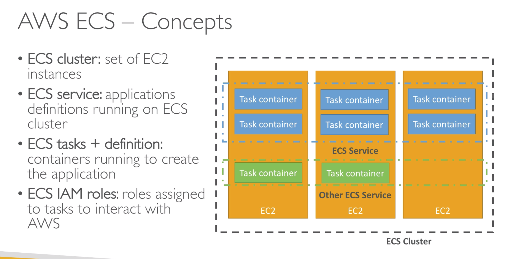
- 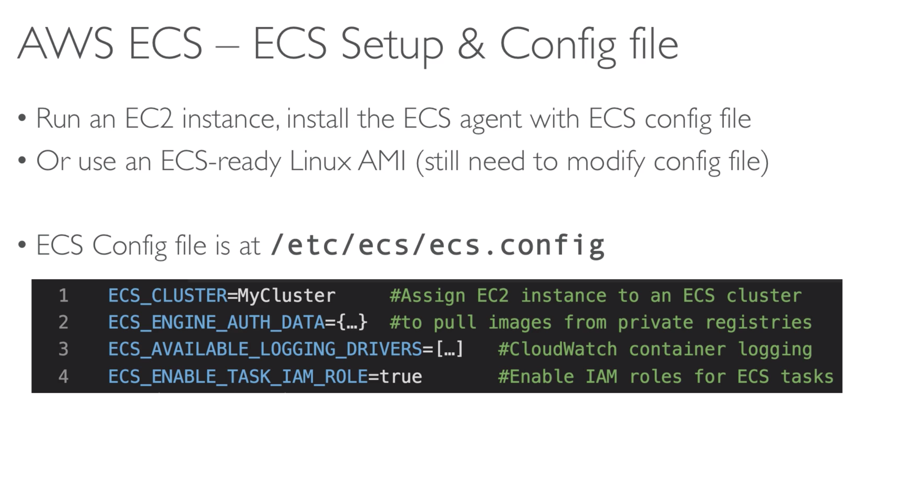
- 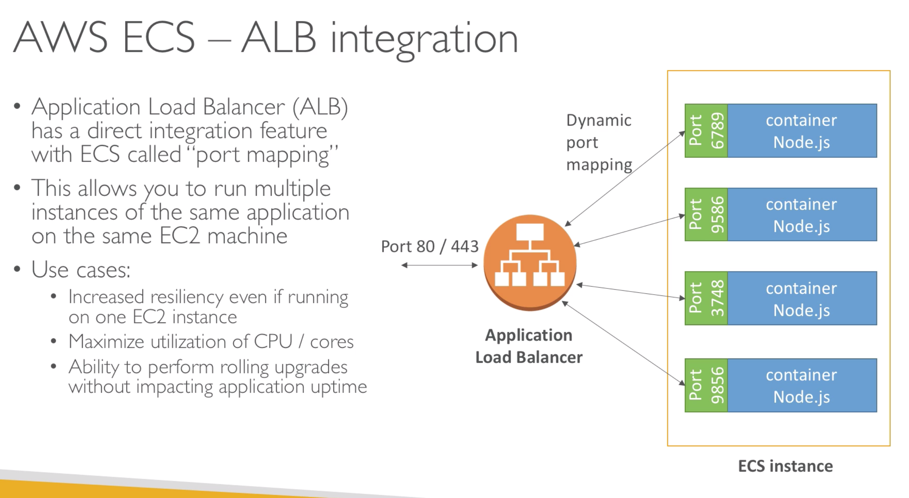
- 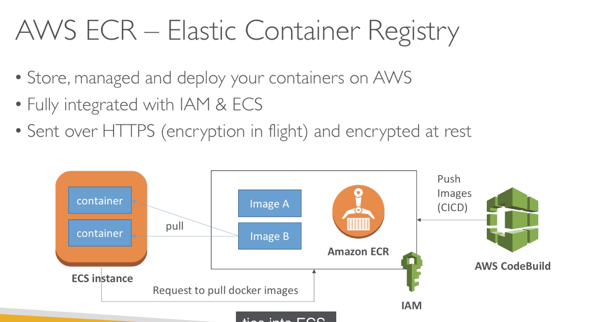

#

## 279. ECS - Extras

- IAM task roles
  - the EC2 instance should have an IAM role allowing it access to the ECS service
  - each ECS task should have an ECS IAM task role to perform their API calls
- Fargate
  - 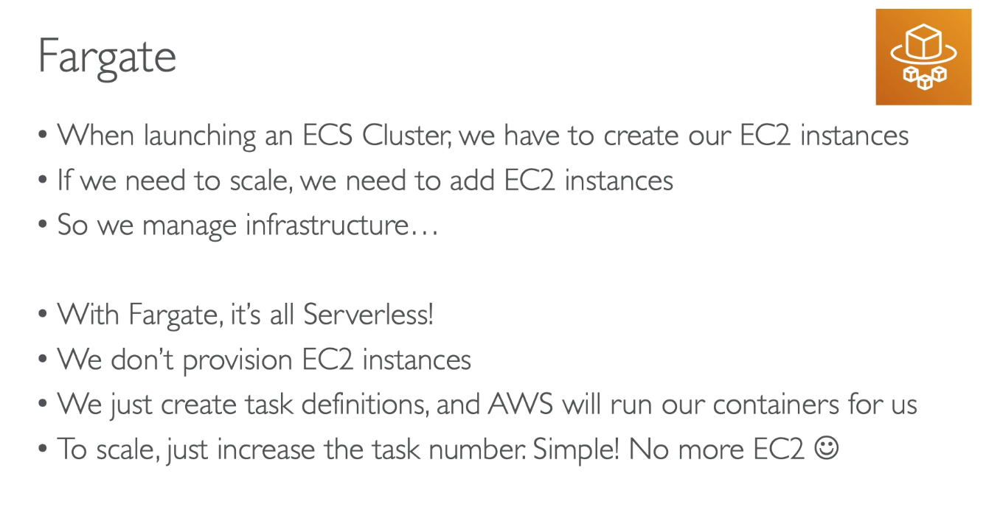

#

## 280. EKS - Overview

- Elastic Kubernetes Service
- way to manage kubernetes clusters in AWS
- Kubernetes is open source software for auto deployment, scaling, and mgmt of containerized applications
- 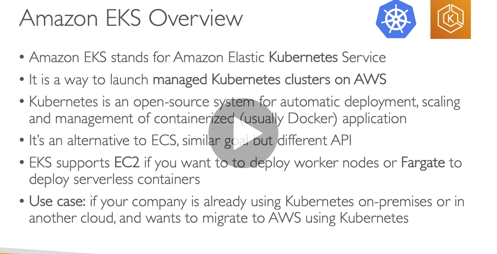

#

## 281. Step Functions & SWF

- way to orchestrate lambda functions
- step functions is newer and recommended vs swf
- only use swf if you need to pass processes from children to parent
- slides
- 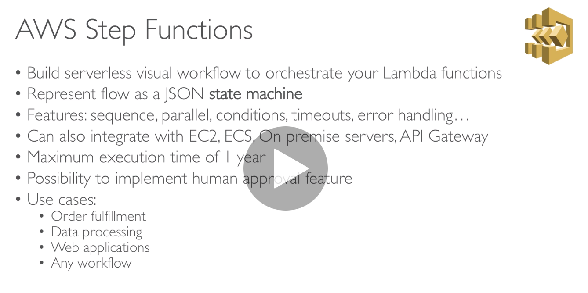
- 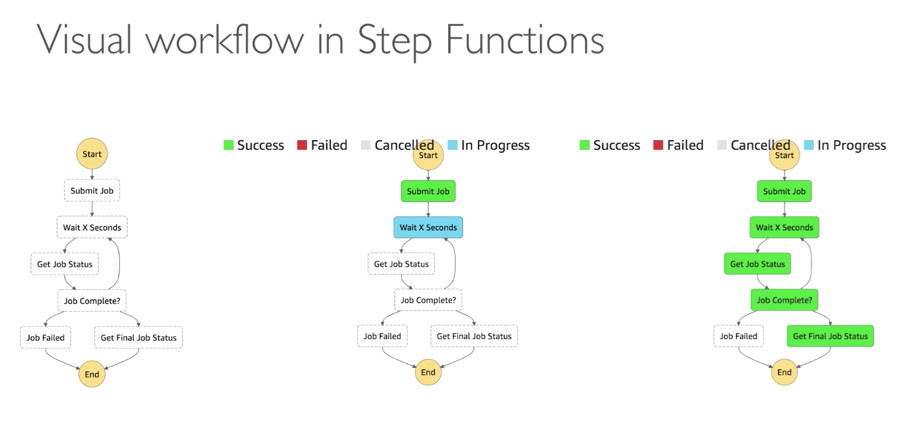
- 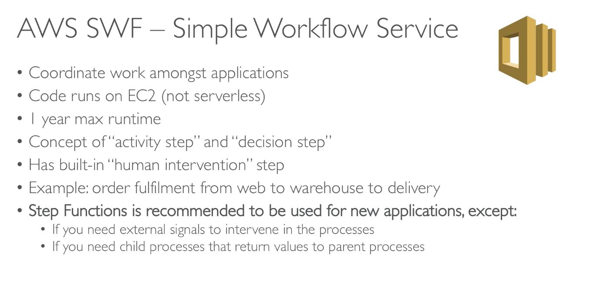

#

## 282. EMR

- Elastic map reduce
- helps create hadoop clusters for processing large data
- 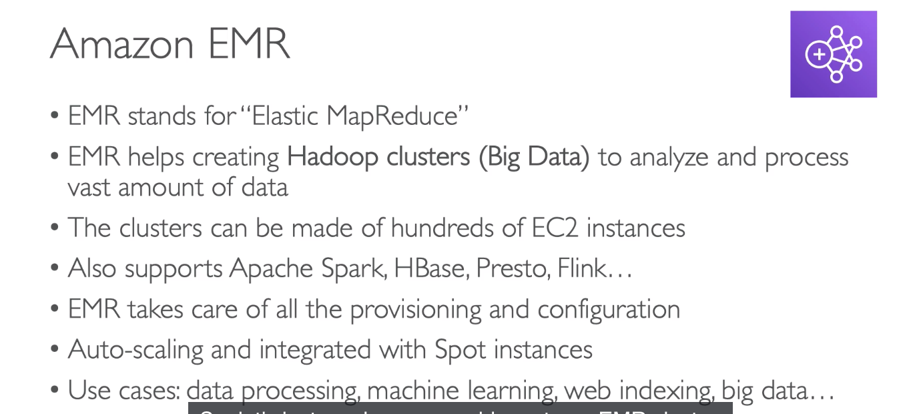

#

## 283. AWS Glue

- newer service, fully managed ETL service
- extract, transform, load
- move data from one source to target and change the data format so it's compatible
- 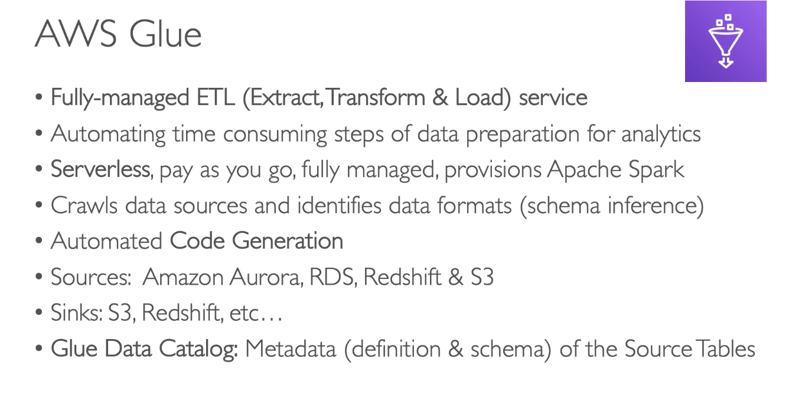

#

## 284. OpsWorks

- 

#

## 285. ElasticTranscoder

-

#

## 286. AWS Workspaces

-

#

## 287. AppSync

-

#

## 288. Other Services: cheat sheet

-

#

## Quiz 23: Other Services: Quiz

-

#
